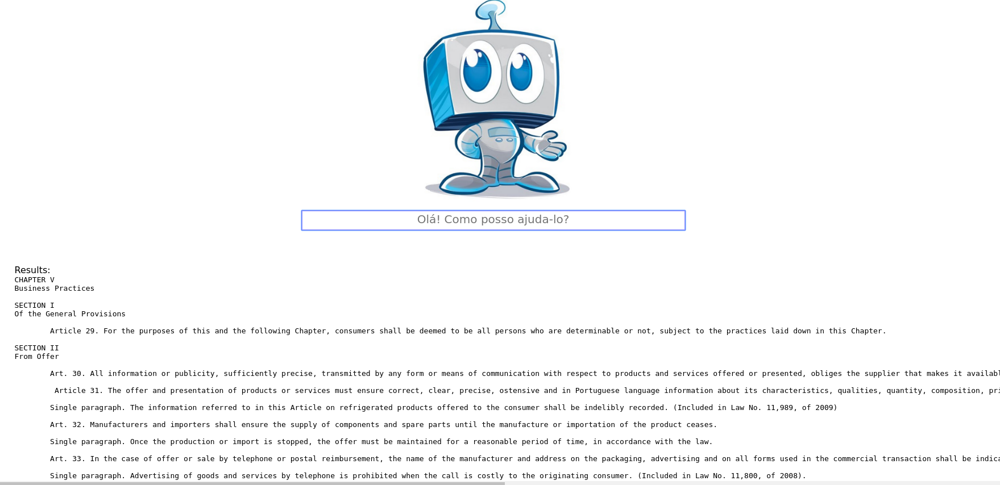

# Siri-Law-Br

## Requirements para o jupyter-notebook / lpython:

* python 3.5.2
* nltk 3.0
* nlpnet-1.2.1

keep pip upgraded. (last version used: pip 8.1.2-1)
```
$ pip install -U pip
```

## Nltk installation:

```
$ sudo pip install -U nltk
```

## Nlpnet installation:
````
$ pip install setuptools
````
Close and reopen terminal then type:
````
$ pip install numpy
$ pip install nlpnet
````

## Added elasticSearch to the project... but still on testing.

# WebSystem using Elastic Search 
-> with nodejs API to comunicate with the elasticsearch

Instalation of the websystem as a archlinux 
(general instructions, also applies for other linux alike systems)

install npm
```pacman -S npm```

install nodeversion manager to install node 6.11.0. Should work with version above too
for more info about the node version manager: github.com/tj/n
```npm install -g n```

install node 6.11.0
```n 6.11.0```

check if version was installed by typing 'n' at your terminal
```n```

## Running the websystem

Go to the folder elastic_node
```cd ./Siri-Law-Br/elastic_node```

Run the server
```node index.js```

server will start at the port localhost:8081 as default
now just open the address at your browser (localhost:8081). When typing anything at the search field, make sure that u have internet connection and your local elasticsearch is running.

## Running the elastic search in the same server as the websystem
Pre-requisite: java 8 runtime enviroment (jre8-openjdk)
Download elastic search and unzip the archive anywhere. Currently using 5.0.0
https://www.elastic.co/downloads/elasticsearch
https://www.elastic.co/downloads/past-releases/elasticsearch-5-0-0

Configure the elastic search to acc request from the same server. Go to config folder, open elasticsearch.yml.
makesure the network.host has 'localhost' as value and 'http.port' has a different port(9200 for example) from the websystem (8081). Now add the lines that will make elasticsearch to receive and send request from the same server
```
network.host: localhost
http.port: 9200
...
http.cors.enabled: true
http.cors.allow-origin: "/.*/"
http.cors.allow-headers: "X-Requested-With, Content-Type, Content-Length, Authorization, Access-Control-Allow-Origin"

```
Enter the folder and execute elasticsearch
```
./bin/elasticsearch 
```
If you dont have the elastic search indexed with cdc already. Check this link below. It has the default structure to make the web system works.
https://github.com/dnovaes/Siri-Law-Br/blob/master/elastic_node/indexing_es.md


Initial screen of the web system.


